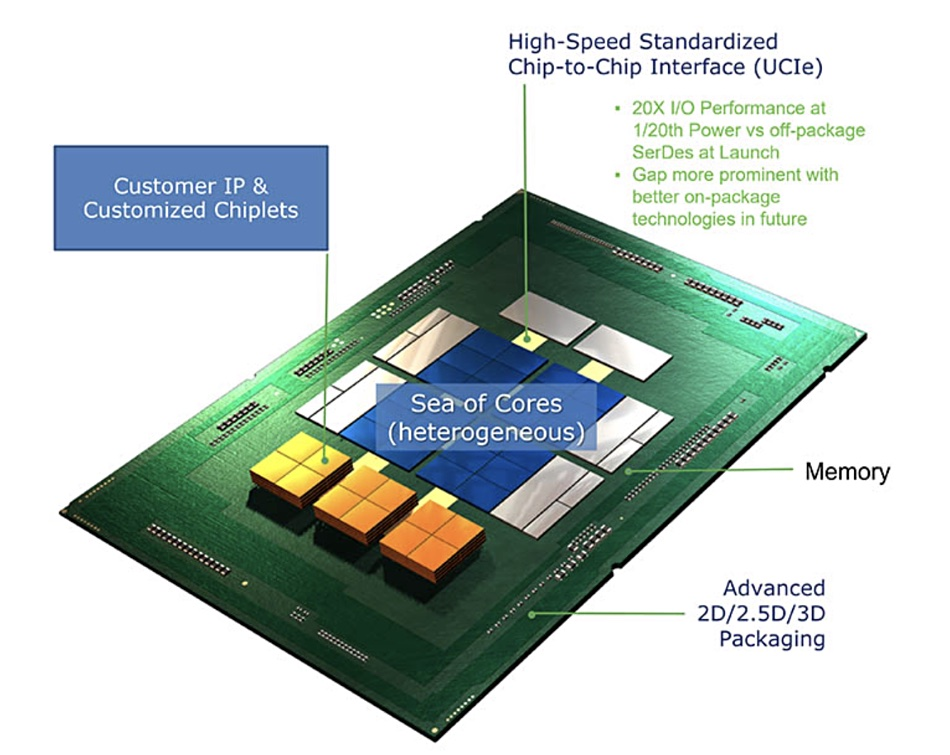

# MediaTek Genio APU AI 部署與推論流程示範

本專案展示在 MediaTek Genio 異構運算平台上實現高效能 AI 模型部署與推論的完整解決方案。透過結合 ARM 處理器架構與 MediaTek 專用 AI 加速器，建構具備零複製記憶體共享機制的協程式非同步推論流程。

<div align="center">


<p><i>MediaTek Genio 異構運算平台工作流程</i></p>

</div>

## MediaTek Genio 異構運算平台架構

Genio 平台採用異構運算設計，將 Cortex-A 系列 CPU、Mali-G 系列 GPU 和 MediaTek 專用 AI 加速器（MDLA、VPU）整合在統一的 SoC 架構中，透過 UCIe（Universal Chiplet Interconnect Express）高頻寬互連技術和共享記憶體子系統，實現跨處理單元的無縫協作。

<div style="background-color: #f6f8fa; padding: 15px; border-radius: 5px; margin: 20px 0;">
<h4>📊 Genio 平台規格比較</h4>
<table>
  <tr>
    <td style="vertical-align: middle; text-align: center; font-weight: bold; background: #f6f8fa;">Provider</td>
    <td colspan="2" style="text-align: center; font-weight: bold;">ArmNN<br>Sea of Cores</td>
    <td colspan="2" style="text-align: center; font-weight: bold;">MediaTek NeuronRT<br>Customized Chipsets</td>
    <td></td>
  </tr>
  <tr>
    <th>型號</th>
    <th>CPU<sub>Cortex-A</sub></th>
    <th>GPU<sub>Mali-G</sub></th>
    <th>DLA</th>
    <th>VPU</th>
    <th>Memory</th>
  </tr>

  <tr>
    <td><b>Genio 510</b></td>
    <td>4x A73 + 4x A53</td>
    <td>G57 MC2</td>
    <td>1x MDLA v3.0</td>
    <td>1x VPU</td>
    <td>4GB LPDDR4X</td>
  </tr>
  <tr>
    <td><b>Genio 700</b></td>
    <td>2x A78 + 6x A55</td>
    <td>G57 MC3</td>
    <td>1x MDLA v3.0</td>
    <td>1x VPU</td>
    <td>8GB LPDDR4X</td>
  </tr>
  <tr>
    <td><b>Genio 1200</b></td>
    <td>4x A78 + 4x A55</td>
    <td>G57 MC5</td>
    <td>2x MDLA v2.0</td>
    <td>2x VPU</td>
    <td>8GB LPDDR4X</td>
  </tr>
</table>
</div>

### 模型部署方案

在 Genio 平台上部署 AI 模型時，需要將模型轉換為 TensorFlow Lite 格式。若您使用 PyTorch 進行開發，可透過 ONNX 中繼格式並使用 onnx2tf 工具完成轉換；TensorFlow 開發者則可直接使用 TFLiteConverter 進行格式轉換。

平台提供兩種主要的推論引擎選擇：ArmNN 引擎適用於 ARM CPU 和 Mali GPU，能夠處理 FP16/FP32 精度運算，適合需要高精度的研究應用；NeuronRT 引擎專為 MediaTek AI 加速器最佳化，特別針對 INT8 量化模型設計，並支援 .dla 格式編譯，能夠在 MDLA或VPU上實現卓越的推論效能。

## 事前準備

本專案提供了完整的 AI 模型部署示範環境。在開始之前，請確保您已完成以下準備工作：

1. **硬體設備**：MediaTek Genio EVK 開發板（支援型號：510/700/1200）
2. **系統安裝**：透過 [Getting Start 指南](https://github.com/R300-AI/MTK-genio-demo/blob/main/docs/getting_start_with_ubuntu_zh.md) 燒錄 Ubuntu 作業系統，並安裝BSPs（`ArmNN`、`NeuronRT`）
3. **環境設定**：開機並依照以下步驟安裝MTK-genio-demo
    ```bash
    # 安裝 Python 套件管理工具（需使用 Python 3.12）
    curl -LsSf https://astral.sh/uv/install.sh | sh  
    ```
    ```bash
    # 下載專案並安裝相依套件
    $ git clone https://github.com/R300-AI/MTK-genio-demo.git
    $ cd MTK-genio-demo

    $ uv add -r requirements.txt  
    ```

## 快速開始

### 推論測試工具

完成環境設定後，您可以在Genio上開啟 Jupyter Lab 了解如何在 Genio 平台上進行 AI 模型的推論與效能評估。

```bash
$ uv run --with jupyter jupyter lab
```

這些 Notebook 範例需要您事先準備好 TensorFlow Lite 格式（.tflite）的 AI 模型檔案。本專案已在 `./models/` 目錄中預先提供範例模型（`./models/yolov8n_float32.tflite`），開發者可直接使用這些模型進行測試。

> - **[ArmNN 模型推論教學](./notebook/armnn_benchmark.ipynb)** - 使用 ArmNN 推論引擎在 Arm 的 CPU 和 GPU 上執行模型推論與效能評估
> - **[NeuronRT 模型推論教學](./notebook/neuronrt_benchmark.ipynb)** - 使用 NeuronRT 推論引擎在 MTK 加速器（DLA/VPU）上執行模型推論與效能評估

### 模型相容性驗證工具

如果開發者想針對 MTK 加速器（DLA/VPU）設計可部署的模型，在實際進行開發前可以預先透過 **NeuronPilot AI Porting Platform** 線上平台驗證模型的相容性。

🌐 **平台網址**：[https://neuronpilot-ai-porting-platform.azurewebsites.net/](https://neuronpilot-ai-porting-platform.azurewebsites.net/)

該平台提供兩種不同的驗證方案：

1. **SDK 整合驗證** - 透過執行程式來檢測模型對各處理器的支援度，支援 PyTorch 和 TensorFlow 框架
2. **模型檔案驗證** - 直接提交模型檔案進行相容性驗證、模型編譯及下載，支援 ONNX 和 TensorFlow Lite 格式

透過此平台的驗證機制，開發者能夠在設計階段就確認模型架構是否適合 MediaTek 的專用 AI 加速器，避免在後續部署過程中遇到相容性問題，有效提升開發效率。


## AI 推論實戰：記憶體共享與非同步優化

本節將以 Ultralytics YOLO 模型為範例，引導開發者實作基於協程架構的非同步即時影像推論流程，全面展現 Genio 平台在記憶體共享與零複製資料傳輸方面的架構優勢與效能潛力。

* **[Ultralytics YOLO 即時串流推論教學](https://github.com/R300-AI/MTK-genio-demo/blob/main/docs/ultralytics_streaming_tutorial.md)**


> 💡 **效能提示**：完成本教學後，您將能夠學會如何將處理步驟拆分為獨立任務，使多核心資源得以充分並行運作，進一步在 Genio 510及 Genio 700上實現流暢的即時物件偵測。
> | 平台型號       | 基準模型    | 預期效能              | 記憶體使用量              |
> |---------------|-------------|----------------------|--------------------------|
> | **Genio 510** | [yolov8n_float32_mdla3.dla](https://github.com/R300-AI/MTK-genio-demo/blob/main/models/yolov8n_float32_mdla3.dla)  | **30 FPS** ||
> | **Genio 700** | [yolov8n_float32_mdla3.dla](https://github.com/R300-AI/MTK-genio-demo/blob/main/models/yolov8n_float32_mdla3.dla)  | **FPS** ||

## 🚀 TO DO List

- [ ] ARM 平台效能分析工具，協助優化推論流程。
- [ ] 📦 MediaTek 專用模型量化精度微調訓練，提升模型部署效率。
- [ ] 🔗 AI 流水線串流框架，支援多源資料即時推論整合。